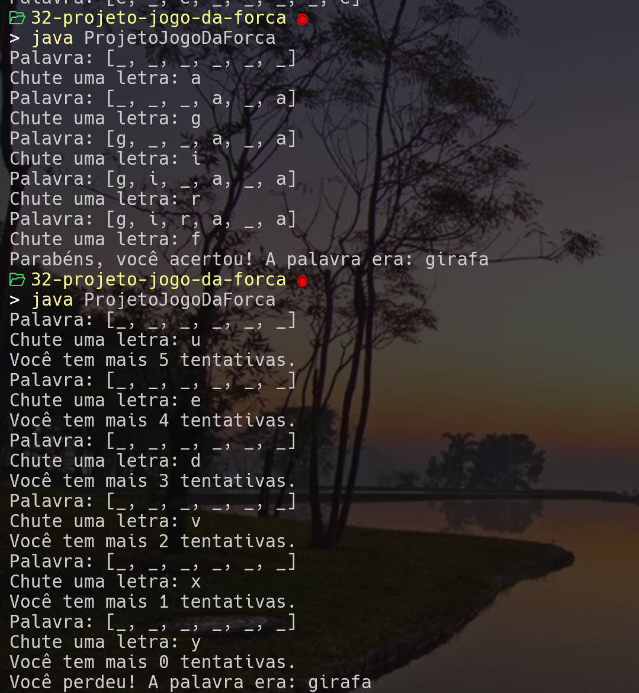

# Projeto Jogo da Forca

## Descrição
Este projeto foi desenvolvido seguindo o curso: [Java Moderno, Fácil de Seguir, com Spring Boot e 11 Projetos](https://www.udemy.com/share/10brPj3@WJAnjwgyy1RSox-juUhmtjHXWBFtEGYmRwkPG50QM_tUTyZbE_XxWbJTanuELq68/), do Professor Eng. Arnaldo Souza.

## Tecnologias
- Java v22;
- JavaFX;
- CSS

## Como Correr o projeto

1- Faça clone deste repositório localmente:
```
    git clone https://github.com/thompsoncarlos/java-jogo-da-forca-udemy.git
```
2 - No terminal execute o comando para rodar projeto
```
    java --module-path "<SEU DIRETÓRIO JAVA>\Java>\javafx-sdk-22.0.1\lib" --add-modules javafx.controls ProjetoJogoDaForca
```


